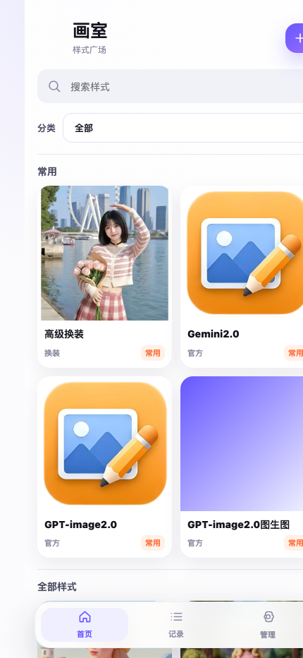
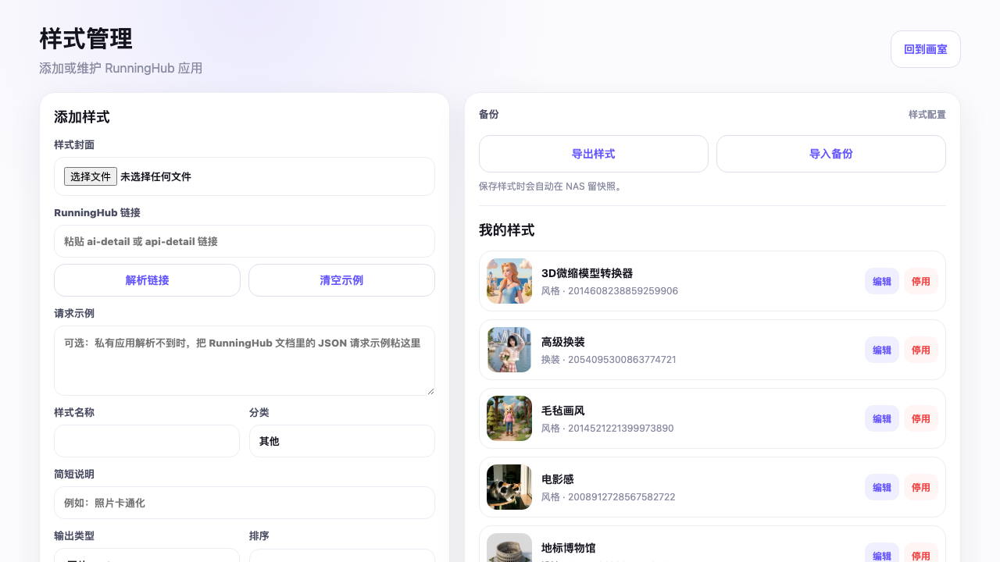

# 画室 Huashi

手机优先的私人 AI 图片工作台，把 RunningHub 应用收进自己的 NAS。

画室的目标很简单：不再反复打开 RunningHub 官网找应用、填节点、下载结果。你把常用的 RunningHub 应用接进来，上传图片或填写参数，画室负责发起任务、轮询结果、缓存输出、自动解压 ZIP 相册，并把历史记录留在自己的机器上。



## 为什么做它

很多 AI 图像应用不是一次性的，它们会变成日常工具：换装、图片 3D 化、卡通化、微缩城市、海报生成、去水印、重打光、角色定妆照。画室把这些工作流变成一个轻量产品：

- 手机打开即可用，适合放在家庭 NAS 或内网小服务器。
- 支持图片、文本、长文本、下拉选项、数字等多种输入项。
- 支持 RunningHub 返回图片或 ZIP，ZIP 可以自动解压成相册预览。
- 有历史记录、保存、下载、重试、删除。
- 有后台样式管理，可以粘贴 RunningHub 链接解析应用，也可以手动微调节点参数。
- 支持样式导出、导入和自动备份，迁移或恢复时不慌。

## 当前功能

### 手机端工作台

- 首页按分类筛选样式，常用样式置顶展示。
- 点进样式后按配置动态渲染输入表单。
- 生成结果可预览、下载、保存到归档目录。
- 记录页可以浏览任务状态和历史结果。

### 样式管理后台

- 添加、编辑、停用 RunningHub 应用。
- 上传样式封面、设置名称、分类、排序、主题色、常用。
- 自动解析 RunningHub 文档里的 `webapp_id`、节点、字段和输入项。
- 私有应用解析失败时，可粘贴 RunningHub 文档中的 JSON 请求示例兜底。
- 导出/导入样式配置；每次保存样式会自动写入 `data/backups` 快照。



### 数据边界

本项目默认把运行数据放在 `data/`：

- `data/db.sqlite`: 样式与任务数据库
- `data/uploads`: 输入文件
- `data/cache`: RunningHub 输出缓存
- `data/archive`: 手动保存的结果
- `data/covers`: 样式封面
- `data/backups`: 样式配置自动备份

`data/` 不进入 Git，避免把私人生成图、历史记录或封面误传出去。仓库里的 `examples/huashi-apps.example.json` 是一份样式配置示例，不含 API key。

## 快速启动

复制环境变量文件：

```bash
cp .env.example .env
```

填写 RunningHub API key：

```text
RUNNINGHUB_API_KEY=你的 key
```

本机启动：

```bash
python3 -m huashi.server --host 127.0.0.1 --port 8787 --data data
```

打开：

```text
http://127.0.0.1:8787
```

后台：

```text
http://127.0.0.1:8787/admin
```

macOS 上也可以双击：

- `启动画室.command`
- `停止画室.command`

## Docker 部署

```bash
docker compose up -d --build
```

默认端口：

```text
http://localhost:8787
```

建议把 `data/` 映射为持久化目录。家庭 NAS 内网使用时，可以直接映射到共享文件夹下的应用目录。

## 备份与迁移

在后台点击“导出样式”会得到一个 JSON 备份，包含样式名称、分类、RunningHub 应用 ID、输入项配置、输出类型、常用状态等。

导入备份时，同 ID 样式会被覆盖。导入前后系统都会自动在 `data/backups` 里留快照。

## 项目结构

```text
huashi/
  server.py              # HTTP 服务与 API
  storage.py             # SQLite 数据模型
  service.py             # 任务编排、下载、解压、备份
  runninghub.py          # RunningHub API 客户端
  runninghub_inspector.py# RunningHub 链接/请求示例解析
web/
  index.html             # 手机端主界面
  admin.html             # 样式管理后台
  app.js / admin.js
  styles.css
docs/
  project-handoff.html   # 给后续 AI/设计师接手的项目说明
examples/
  huashi-apps.example.json
```

## 开发检查

```bash
python3 -m unittest discover -s tests -v
python3 -m py_compile huashi/*.py
node --check web/app.js
node --check web/admin.js
```

## 路线图

- 更强的移动端 UI：样式市场、收藏、搜索和生成态还可以继续打磨。
- 更完整的输入控件：多图上传、滑块、开关、枚举组、参数模板。
- 更稳的 RunningHub 解析：从文档页自动提取更多字段，减少手动修正。
- 多用户或 PIN 保护：目前更适合内网个人使用。
- 自动清理策略：缓存、归档、备份可以按空间或时间规则管理。

## 适用场景

画室不是一个通用云平台，它更像“自己的 AI 图片遥控器”：应用跑在 RunningHub，入口和结果留在自己的 NAS。
